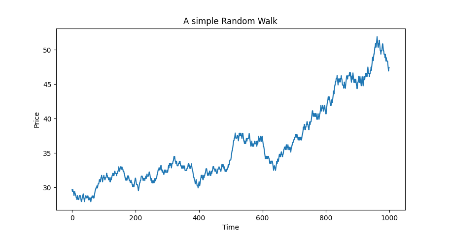

### Code Compilation

In order to compile the code and create the output file, execute the following commands

```
c++ -std=c++2a -o RandomWalk.o -c RandomWalk.cpp
c++ -std=c++2a -o RandomWalk RandomWalk.o
```
To see the sample random walk data, just enter
```
./RandomWalk
```
Generate the `.csv` file by redirecting the output using
```
./RandomWalk > RandomWalk.csv
```
And finally in order to view the price behaviour over a simulated period of time, run
```
python3 PlotWalk.py
```
### A Sample Random Walk
<br>
 

### To-do
- [ ] Allow user to set step, start and number of walks
- [ ] Create Makefile
- [ ] Automatically save the image
